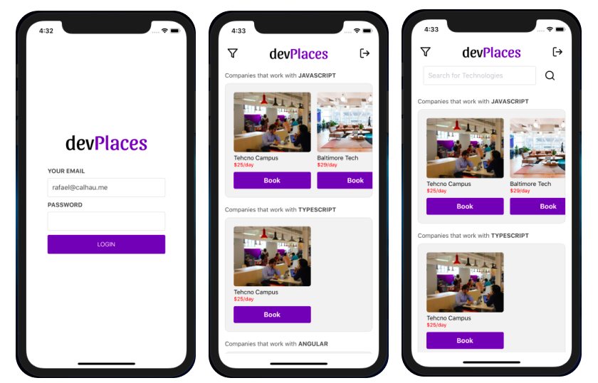
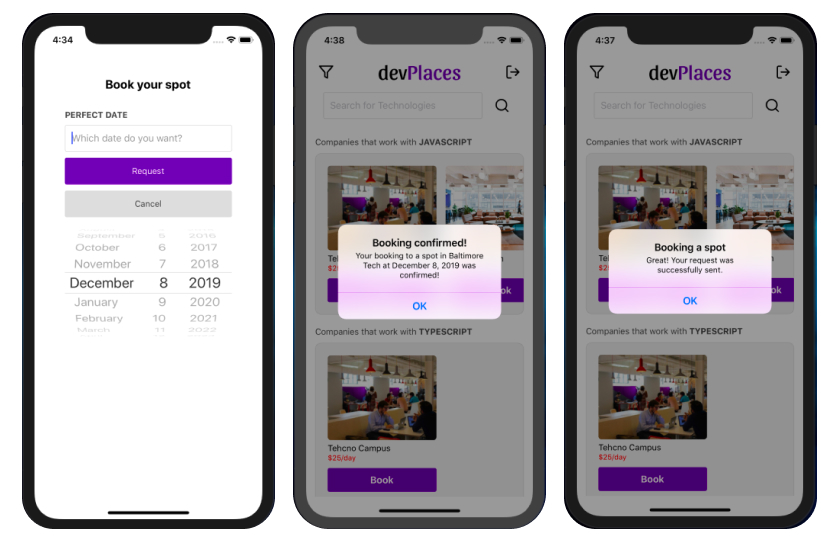

[](https://opensource.org/licenses/MIT)
[](https://standardjs.com)


# devplaces-mobile

Mobile application for the project devPlaces which is inspired in Rocketseat Omnistack Week 9




## Installation

Clone the project

  ```bash
  git clone https://github.com/rafaelcalhau/devplaces-mobile.git devplaces-mobile
  ```

Navigate into the project folder

  ```bash
  cd devplaces-mobile
  ```

Install all dependencies using the NPM or YARN

  ```bash
  npm install # or yarn
  ```

## Settings

There is a settings file and you can utilize it in order to configure the App's name, API server address, socket URL and more.
  
  > app.json


## License
[MIT](https://choosealicense.com/licenses/mit/)